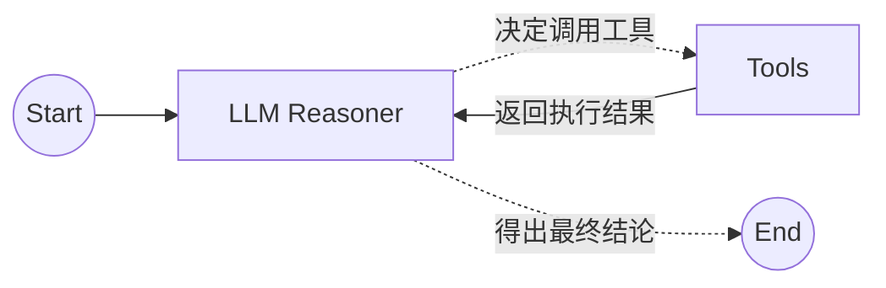
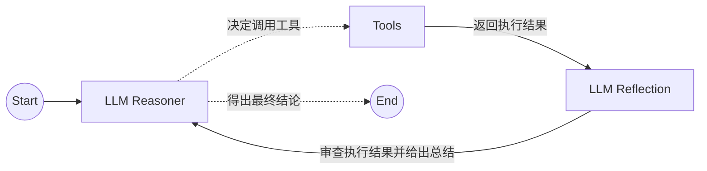
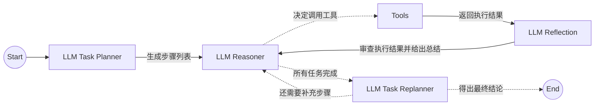
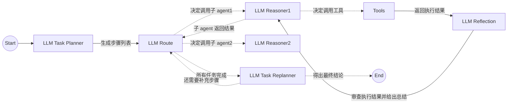

---
## 一、计算机网络
### 1、网络模型
#### 应用层（表示层，会话层）
- 核心协议： HTTP/HTTPS (Web)，DNS (域名解析，走 UDP/DoH/DoT)，SSH (远程登录)
- URL：`URI = scheme:[//authority]path[?query][#fragment]`
- DNS：浏览器缓存，操作系统缓存，hosts 文件（系统级命令则 host 文件优先），本地 DNS 服务器缓存，根 DNS 服务器，子 DNS 服务器
#### 传输层
- tcp 头：`SYN`（synchronize）是发起一个连接，`ACK`（acknowledgment）是回复，`RST`（reset）是重新连接，`FIN`（finish）是结束连接，`PSH`（push）是催促对方不要让数据在缓冲区里过度停留，`ECE`（ECN-Echo）是接收方告诉发送方：“我刚才收到的包里，路由器打上了拥堵标记”，`CWR` （Congestion Window Reduced）是发送方用来回应接收方的 ECE，即我已减小了发生窗口
- 双方端口号
#### 网络层
- ip 头：双方 ip，传输层协议
- CIDR：确定子网掩码的 1 的位数，如 /26
- NAT：路由器实现出关改源 ip，入关改目标 ip（路由器会跟踪客户端的 TIME_WAIT，除非端口不够）
- ARP：ip 映射 mac，没有则广播
- RARP：局域网内用 mac 求 ip（现在不常用）
- vip：即虚拟 ip，通过 Keepalived 在单点故障时给备用机切换 ip 保证高可用（需要保证该 ip 被 DHCP 剔除）
#### 数据链路层
- mac 头：双方 mac
#### 物理层
### 2、HTTP
- 常见状态码，请求头字段
- GET 和 POST 的安全性和幂等性
- 协商缓存：用最后修改时间字段或者唯一哈希值标识来判断，304 状态码表示缓存还能用
- 1.1：
	- 客户端请求时默认添加 Connection: keep-alive，服务端响应时同意长连接并规定 timeout 和 max（最多处理多少请求）
- 1.1 缺点：
	- 无状态
	- 明文传输
	- HTTP 队头阻塞（虽然可以不等响应接着发请求，但响应依旧要排队，并发请求无意义，一般浏览器默认禁止管道传输）
- 1.1 优化方案：
	- 缓存避免请求
	- 合并减少请求（多个图片一起发（但会导致要发单个图片也只能发多个的浪费），转成 base64 嵌入到 html 里发）
	- 延迟请求发送，按需获取
	- 无损压缩，有损压缩（视频的静态的关键帧）
- 2：
	- 头部可压缩（帧头）：静态字典，动态字典，哈夫曼编码
	- 同一请求响应对应唯一 Stream ID 保证并发，ID 递增到上限时断开 tcp（但还是会造成 TCP 阻塞）
	- 通过特殊帧 PUSH_PROMISE 实现服务端 push（会导致缓存浪费，已被废弃）
- 3 优点：
	- 基于应用层的 QUIC 协议，内嵌 TLS 1.3
	- 无阻塞，因为 UDP 缺分片照样上报给应用层
	- QUIC 和 TLS 都在用户态，可以整合握手次数（TCP 在内核态无法整合）
	- 避开了 TCP 的慢启动
	- 单独申请一个 stream 用来同步动态表的变化（原动态表的同步依赖于上一个含动态字段的请求，这也会导致堵塞）
	- 不依赖四元组，通过连接 id 来标记通信双方，便于连接迁移
- 3：
	- UDP 头部
	- QUIC 报文头（Packet Header）：分为 Long Header（源连接 id，目标连接 id），Short Header（目标连接 id，Packet Number），其中 Packet Number 用于丢包判断，且重传时也严格 +1 不与之前的包重号
	- QUIC 帧头部 （Frame Header）：一个 UDP 包含一个报文包含多个帧，比如 Stream Frame，装的是一个请求的一部分，有 Stream ID 和 Offset，代表哪个请求的哪部分，用于数据重组
	- Stream 级别与 Connection 级别双层控流
- 3 缺点：
	- ack 只能由用户态去做，会导致频繁的系统调用，可以批处理或让用户态接管网卡内存
- HTTPS：
	- SSL/TLS，属于表示层（os 用户态）
	- 1.2：四次握手（非对称加密得出对称密钥）
		- 客户端列出自己支持的所有加密算法
		- 服务器挑一个算法，并发送 CA 私钥签名过的证书（包含服务器公钥）
		- 客户端用 CA 公钥检验证书的合法性，并发送用服务器公钥加密的随机数
		- 服务器用服务器私钥解密随机数
	- 1.3：两次握手（利用 ECDHE 算法（底层是 DH 算法 + ECC + 临时的 Ephemeral））
		- 客户端直接发送用自己的临时密钥加密的随机数
		- 服务器返回用自己的临时密钥再次加密的随机数（包含在证书里）
	- 会话复用：
		- 各自缓存 Session ID 和会话密钥，客户端重连时带上 Session ID
		- 第一次连接时服务器发送加密后的会话密钥 Session Ticket，只由客户端缓存
		- 通过上一轮的会话密钥和随机数算出新一轮的会话密钥，保证前向安全
		- 在 1.3 的重连中，客户端会把 Ticket 和 HTTP 请求一同发送给服务端，实现 0 握手，但 0 RTT 会有重放攻击的危险，即第一次请求是非幂等的，黑客拦截请求然后重复发（黑客如果利用同一个 tcp 连接拦截不是第一次的请求重复发，会因为隐式序列号对应不上而失败）
	- 非对称加密：通过质数的一些原理，有 SRA，ECC（引入椭圆曲线）
### 3、SSH 
- 用 DH 算法生成会话密钥
- 双向验证：互相用各自的私钥签名，用对方的公钥验签
- 服务器第一次发来的公钥需要被信任
- 也可以通过密码的方式让服务器信任
### 4、RPC
- **R**emote **P**rocedure **C**all，**远程过程调用**
- 不依赖 DNS 去做服务发现，可以用比如 redis
- 建立连接池以便复用
### 5、WebSocket
- 全双工（HTTP1.1 是半双工，同一时间只有一方能主动发数据）
- 通过 payload 字段规定每段数据长度，避免粘包
- 分为文本帧和二进制帧等，方便接受者判断该怎么处理
- 需要发心跳保活，以防被路由器掐掉 tcp 连接（tcp 自己的保活心跳是两小时，一般不重要）
- 简单场景下可以用短轮询和长轮询来替代
### 6、TCP
- 面向连接（只能一对一，而 UDP 可以一对多），可靠，字节流
- tcp 会预判 ip 的分片，极力避免 ip 的分片，设置 MSS（Maximum Segment Size 最长报文大小），因为 ip 分片后丢失没法按片重传
- 序列号 SEQ：在建立连接时由计算机生成的随机数作为其初始值，每发送一次数据，就「累加」一次该「数据字节数」的大小，其中 SYN 和 FIN 算一个字节数
- 确认应答号 ACK：指下一次「期望」收到的数据的序列号，发送端收到这个确认应答以后可以认为在这个序号以前的数据都已经被正常接收
- 乱序段：乱序段会先存到一个红黑树里（老版本是链表），前提是序列号在接收窗口内
- PAWS 防止序号回绕：用时间戳来判断，RST 是一个例外
- 正常传数据为 [PSH, ACK]
- 三次握手：`SYN`，`SYN + ACK`，`ACK`
	- 服务端：`LISTEN`，`SYN_RCVD`，`ESTABLISHED`
	- 客户端：`SYN_SENT`，`ESTABLISHED`
	- 为什么是三次：阻止重复的历史连接（给客户端一个拒绝的机会），避免服务器提前打开资源导致浪费，同步双方的初始序列号
	- 第三次握手可以顺带发送请求
	- 半连接队列（哈希表）：已满后，若开启了 net.ipv4.tcp_syncookies，服务器接收到的第一次握手的连接不再放入半连接队列，而是计算 cookie 后直接一并返回，第三次握手时检查 cookie 的合法性，负责丢弃
	- 全连接队列（链表，不关心取出的是哪个）：如果满了（说明业务处理不过来），tcp_abort_on_overflow 设置为 0 时，直接丢弃第三次握手，当然客户端收不到 ack 会重发，设置为 1 时，会返回 rst
	- SYN 攻击：扩大半连接队列，开启 tcp_syncookies，减少服务器 SYN+ACK 重传次数（即重传达到一定次数直接从半连接队列里丢弃）
	- TCP Fast Open：SYN + Cookie + 请求（或 tls 握手），如果服务器也开启了 TFO 且 Cookie（这里的 Cookie 是 tcp 头的一个可变字段）检测通过，则发 SYN + ACK + 响应，当然第一次客户端没有 Cookie 会向服务器索要
	- 一方发送 SYN 后，如果先收到对方的 SYN，说明双方同时要建立连接，进入特殊状态 SYN-RECEIVED 中，并直接返回 ACK ，然后在收到对方 ACK 后进入 ESTABLISHED，此时双方都没有 listen() 端口（自连接）
- 四次挥手：`FIN`，`ACK`，`FIN`，`ACK`
	- 主动断开方：`FIN_WAIT1`，`FIN_WAIT2`，`TIME_WAIT`，`CLOSE`
	- 被动断开方：`CLOSE_WAIT`，`LAST_ACK`，`CLOSE`
	- 如果 FIN_WAIT1 状态的孤儿连接太多，后续要断开的连接会直接发 RST 暴力关闭
	- FIN_WAIT2 状态下的连接等了 2 MSL（Maximum Segment Lifetime 最大报文生存时间）（共 60 秒）没收到对方的 FIN 也会 RST 暴力关闭
	- 主动断开连接方设置 TIME_WAIT 为 2 MSL，不释放端口，防止历史连接中的数据，被后面相同四元组的连接错误的接收
	- 服务器出现大量 TIME_WAIT 状态的原因（即服务器主动断开连接）：没有使用长连接（服务器在响应时顺便就发了 FIN），长连接超时，长连接的请求数量达到上限（timeout 和 max 由服务器规定并控制）
	- 只出现了三次挥手，可能是因为 tcp 的延迟确认（当 ack 没有带数据的时候，会等 200ms 或收到对方第二个段或自己要发数据才一并发送）
	- 一方发送 Fin 后，如果先收到对方的 Fin，说明双方同时断开连接，进入特殊状态 CLOSING 中，并直接返回 ACK ，然后在收到对方 ACK 后进入 TIME_WAIT
- 滑动窗口：大小由接收方决定，分为 swnd 和 rwnd
	- 比如发送方给了 500 字节，但接收方暂时只能处理 300，那么剩下 200 放入缓存区，rwmd 减少 200，ack 回信也要告诉发送方让 swnd 减少 200
	- 在 swnd 归 0 后，发送方会定时发一个窗口探测，询问 rwnd 有没有变化，接收方也可以主动通知
	- 为避免 rwnd 太小导致发送的 tcp 太小，tcp 头占比太大不划算，接收方在 rwnd 小于 min( MSS，缓存空间/2 )时会回信告诉发送方 swnd 为 0（即接收方不告知小窗口），同时在 swnd 和数据大小大于 MSS 或者收到 ack 时才回信（即发送方不发送小数据，Nagle 算法）
	- 滑动窗口大小可以根据双方缓冲区大小和带宽时延积（小于滑动窗口才能跑满）进行调节
- 慢启动：
	- 刚开始，拥堵窗口 cwnd 指数增长 (`1 -> 2 -> 4`)
	- 到了阈值，cwnd 线性增长 (`n -> n+1`)      
	    - 如果超时（超时重传）：cwnd 归 1，慢启动门限 ssthresh 设为 cwnd/2，重新慢启动
	    - 如果收到 3 个重复 ack（快速重传）：cwnd 和 ssthresh 都设为 cwnd/2，直接快速恢复（线性增长）
- 重传：
	- 超时重传：RTO（Retransmission Timeout 超时重传时间），基于 RTT（Round-Trip Time 往返时间，网络时延）动态计算
	- 快速重传：SACK 将已收到的数据的信息发送给发送方，发送方就可以只重传丢失的数据，Duplicate SACK（D-SACK）告诉发送方哪些数据发重了，让发送方恢复自己的 cwnd 惩罚
- 复用还在 TIME_WAIT 的端口：
	- tcp_tw_recycle：已被废弃，用于服务端节约内存，提前释放 socket，只保留 ip 和时间戳，在 nat 转换下可能出现相同 ip 但不同的计算机的新请求因为时间戳小而被丢弃
	- tcp_tw_reuse：用于客户端在端口不够时使用，前提是 TIME_WAIT 超过了 1 秒（对方 ip 不同时是可以用同一个端口的）
	- SO_REUSEADDR：用于服务重启时的端口重复绑定
- challenge ack：
	- SYN：普通状态下，收到相同四元组的非法序列号的 SYN（通常是连接一方宕机，重启时重连，或跳过 TIME_WAIT 发新连接，而旧连接的最后一次握手 ACK 还没发送到位），会回复 challenge ack，重连方没等到期待的 SYN + ACK，就发 RST 断掉旧连接，如果是黑客发的 SYN，收到 challenge ack 不管就行；在 TIME_WAIT 状态下，如果收到相同四元组的大的序列号，认为是新连接，直接跳出 TIME_WAIT 状态去建立新连接，如果收到相同四元组的小的序列号，回复 challenge ack，重连方就发 RST
	- RST：收到相同四元组的序列号在接收窗口内的 RST（可能是路由器防火墙发的，它不知道该连接的序列号），回复 challenge ack，断开方拿到确切的序列号后再发 RST，如果在接收窗口外的话，认为是 RST 盲打攻击直接忽略（在默认情况下，在 TIME_WAIT 状态中的连接是可以被 RST 关闭的，但是也有个参数 net.ipv4.tcp_rfc1337 开启后可以无视）
- 进程挂掉后，内核线程回收该线程的 socket，如果没缓冲数据就发 FIN，有缓冲数据就发 RST
### 7、UDP
- UDP 端口和 TCP 的端口互不相干
- 不通过四元组区分 socket，只认接收端的 ip 和端口，所有发送端的 ip 和端口要应用层自己作区分
- 客户端可以调用 connect()，告诉内核该端口以后只发向和接收哪个对方的 ip 和端口，以防黑客信息干扰
- 依赖应用层或网络层的分包，一般是前者，因为网络层在丢包后会等待，但 UDP 不管，网络层等待超时后就只能把整个包丢弃
- 包只要发出去了，socket 缓冲区和 ring buffer 里的缓存全会被清空（TCP 只会清理 ring buffer，socket 缓冲区得等待对方确认收到再情空）
### 8、IP
- 路由表：
	- 最长匹配原则
	- 源地址选择算法（操作系统自动选择出站网卡的主 ip，当然也可以自己指定）
	- 目的 ip 填自己的 ip 会绝对优先走 lo，填 0.0.0.0 会在 socket 底层改为 127.0.0.1

|目的网段|子网掩码|下一跳|出站网卡|
|:---:|:---:|:---:|:---:|
|`192.168.2.0`|`255.255.255.0`|`10.0.0.2`|`eth1`|
|`10.0.0.0`|`255.255.255.0`|`Direct`|`eth0`|
|`127.0.0.0`|`255.0.0.0`|`127.0.0.1`|`lo`|
|`0.0.0.0`|`0.0.0.0`|`10.0.0.1`|`eth0`|
- 私有 ip：10，172.16 - 172.31，192.168（不同网段的私有 ip 可以建立专线通道来通信，如虚拟机软件网卡，不然目的 ip 为私有 ip 的包会被路由器丢弃）
- D 类 ip：224 - 239（用于组播）
- 回环 ip：127
### 9、ICMP
- 属于网络层，没有传输层和应用层，没有端口号
- 通过原始套接字 SOCK_RAW + 指定协议 IPPROTO_ICMP 创建
- 封装在 IP 头部中，协议字段（Protocol）填 1
- 如果是主动 ping（查询报文类型），会在头部的 Identifier 标记进程 id，回信时就能找到该进程
- 如果是被动收到（差错报文类型），会根据原本 TCP 的四元组进行标记，并翻译成一个系统调用错误码挂在对应 socket 上，影响 TCP 的发送策略
- 差错报文类型：目标不可达消息（主机，端口，协议，需要进行分片但设置了不分片），原点抑制消息（已被废弃），重定向消息（不是最优的路由路径），超时消息（TTL 为 0，用于 traceroute）
### 10、IGMP
- 封装在 IP 头部中，协议字段（Protocol）填 2
- 用于组播
- 加入组，离开组，普遍查询
### 11、DHCP
- 封装在 UDP 中
- 分配 ip 地址，子网掩码，默认网关，本地 DNS 服务器地址，租期
- D - Discover（发现）
- O - Offer（提供）
- R - Request（请求）
- A - Acknowledge（确认）
### 12、socket
- 通过四元组哈希查找对应 socket
- `socket()`：向操作系统申请创建一个 socket 实例
- `shutdown()`：不释放 socket 的文件描述符，可选择性关闭单向或双向通道
- `close()`：把 socket 的引用计数减 1，如果减完后小于等于 0 就关闭文件描述符（fork 进程的时候会出现 socket 计数大于 1）
- 服务器
	- `bind()`：把这个 socket 绑定到一个具体的 IP 地址和端口号上
	- `listen()`：操作系统会为你创建半连接队列和全连接队列，开始监听
	- `accept()`：从全连接队列中拿出一个已经完成三次握手的连接（UDP 没有）
- 客户端
	- `connect()`：拿着服务器的 IP 和端口号，主动向服务器发起连接请求
## 二、操作系统
### 1、硬件结构
- 硬中断：由硬件触发中断，用来快速处理中断
- 软中断：由软件触发中断，用来异步处理硬中断上半部未完成的工作，或者系统调用等
### 2、系统结构
- linux：
	- _MultiTask_，多任务
	- _SMP_，对称多处理
	- _ELF，（Executable and Linkable Format）_，可执行与可链接格式
	- _Monolithic Kernel_，宏内核
- Windows NT：
	- 混合型内核（宏内核，微内核）
### 3、文件管理
- 用户空间 API`->`虚拟文件系统（VFS - Virtual File System）`->`具体文件系统（ext3/4（linux）、XFS（linux 日志）、NFS（linux）、SMB（windows））`->`通用块层
- 数据结构：
	- Inode 索引节点：文件类型，权限，文件大小，时间戳，链接数，指针（指向数据块，address_space 等）
	- Data Block 数据块：4kB
- Dentry 目录项：在文件夹的数据块中所存，包括文件名和对应的 Inode，在内存上会单独维护
- 文件存储：多级索引分配
- 空闲空间管理：位图
- 组块：超级块，块组描述符，inode 位图，数据位图，inode 列表，数据块
- 硬链接，两个文件名指向同一个 inode；软链接，一个 inode 的数据块中存的是另一个文件名
- 文件描述符：每个进程维护一个数组，数组的下标就是 fd，数组的每个位置记录着一个系统级的打开文件表，里面记录着该文件的动态状态（文件打开计数器，打开模式）和 Inode
- address_space：由每个 Inode 维护，记录着文件偏移量和物理地址的映射关系，通过 XArray/Radix Tree 基数树去维护。在缺页中断时，内核拿着虚拟地址，从虚拟内存区域查到了文件偏移量，再通过 address_space 找到物理地址，如果找不到就先通过 Inode 指向的数据块从磁盘中读出来，最后建立起物理地址和虚拟地址的映射关系
### 4、内存管理
- 虚拟内存：
	- 内存管理单元（_MMU_）：硬件用数学公式 O(1) 盲查
	- 32位（1G + 3G），64位（128T +128T）
	- 分段
	- 分页：
		- 解决外部内存碎片问题 
		- 根据页号，从页表里面查询对应的物理页号，加上偏移量得到物理内存地址
	- 多级页表：
		- 32位：1 页占 4kB（2^12），2^10 个页表项组成一级表，一个页表项占 4B，所以一级表占 4kB，2^10 个一级表又组成二级表
		- 48位：9+9+9+9+12（2^9 个页表项组成表，一个页表项占 8B）
		- 48位大页：9+9+9+21（2mB），9+9+30（1gB），大页会被锁（Pin）在物理内存中无法 swap
	- TLB（Translation Lookaside Buffer，快表）：硬件缓存，通常只有 512 到 1024 个页项，进程切换就会清空
	- `CR3` 寄存器（Control Register 3，控制寄存器 3）：操作系统在内核里维护着每个进程的顶级页表，在开启进程时会将其对应的顶级页表的物理地址存入寄存器当中
	- 所有进程的页表中的内核空间的虚拟地址映射都是相同的
	- MMU 通过虚拟地址映射到物理地址发现不可用后，会触发缺页中断（Page Fault），此时操作系统才会按需分配数据页
- malloc()：
	- 属于 C 语言函数，可以直接填想要的字节，底层会一次性申请更多，减少后续系统调用
	- brk()：申请小内存，移动堆顶指针，free() 后不释放，会产生内部内存碎片
	- mmap() 带上私有匿名映射参数：申请大内存，属于内存映射区，free() 后释放（具名映射是将文件映射到用户虚拟地址空间但加载到 pagecache 中，当然同样是缺页中断时才加载，如果是私有的还会写时复制到用户物理地址空间）
- 回收机制：
	- 文件页：干净就直接丢弃，脏就先写回到 pagecache，再通过 kswapd 内核线程定时异步写回磁盘，如果内存实在紧张或手动调用函数（sync() 所有文件的所有数据，msync() mmap() 的所有文件，fsync(fd) 指定文件的所有数据，fdatasync(fd) 指定文件的普通数据，必要时也包括其元数据），会立马同步阻塞写回
	- 匿名页：比如堆栈数据等，swap 到磁盘
	- OOM：直接杀死进程
	- NUMA 架构（不同的 cpu 组不共用一套内存）：可以暂时挪到在其他组的内存当中
- 预读失效和缓存污染：区别活跃链表和非活跃链表，并提高进入活跃链表的门槛
```
+------------------------+  0xFFFFFFFF (4GB)
|     内核空间 (1GB)      |  (所有进程共享，用户态不可直接访问)
+------------------------+  0xC0000000 (3GB 分界线)
|       栈区 (Stack)     |  (向下生长 ↓)
|         |              |
|         v              |
|                        |
|   内存映射段 (mmap)     |  (动态库、mmap映射区，通常向下生长)
|                        |
|         ^              |
|         |              |
|       堆区 (Heap)      |  (向上生长 ↑)
+------------------------+
|   BSS段 (.bss)         |  (未初始化的静态/全局变量)
+------------------------+
|   数据段 (.data)       |  (已初始化的静态/全局变量)
+------------------------+
|   代码段 (.text)       |  (可执行的机器指令，只读)
+------------------------+  0x08048000 (通常的起始地址)
|      保留区            |  (不可访问，用于捕获空指针)
+------------------------+  0x00000000
```
### 5、进程管理
- 进程的状态：创建 new，就绪 ready，运行 running，阻塞 blocked，结束 terminated
- 进程控制块（_process control block，PCB_）：以链表形式被挂载在就绪队列或阻塞队列里，在 linux 的具体数据结构是 task_struct
	- 包括 pid，tgid，状态，优先级，parent，children，mm_struct（用于管理内存）指针，files_struct（包含文件描述符表）指针，pending（信号位图），sighand_struct（信号处理函数的集合）指针，thread_struct（在上下文切换时保存状态），stack（内核栈）指针
- 进程的上下文切换：用户进程陷入内核，内核通过调度算法切换，并保存当前状态
	- 陷入内核的方式：系统调用，时钟中断，发生异常
	- 陷入内核本身也是一种上下文切换，需要保存当前状态，而硬件通过 TSS（Task State Segment，任务状态段，一个硬件结构）的 sp0 字段找到该进程内核栈的地址，这个字段在进程将要运行的时候由内核写入
- 进程和线程：
	- 每个进程和线程都有独立的 pid，进程有专属的 tgid 并和其 pid 一致，线程的 tgid 为其所属的进程的 pid
	- 共享：堆，虚拟页表，文件描述符表
	- 不共享：栈，寄存器状态
	- 创建：进程用 fork()，部分资源会暂时和父进程共用，写时复制，如果想把继承下来的东西丢掉，并加载其他东西变成一个独立的新进程，还要用 exec()；线程用 pthread_create()（底层用的是 clone()），部分资源直接和进程共用
	- 0号进程：唯一的原生进程，生下 1 号和 2 号进程后，它的唯一工作就是，当 cpu 没有任何其他任务可做时，就运行 0 号进程，让 cpu 进入低功耗休眠状态
	- 1 号进程：是第一个用户进程，用来创建其他用户进程并收养孤儿用户进程（父进程死亡的进程）
	- 2 号进程：是第一个内核进程，用来创建其他内核进程
- 进程的调度：
	- 实时任务（优先级 0~99），普通任务（优先级 100~139）
	- 对于普通任务，用完全公平调度算法（CFS），底层数据结构是红黑树
	- 每个 cpu 线程和超线程各一个运行队列
- 进程间通信：
	- 管道：面向字节流，先进先出，单向。匿名，通过 fork() 进程共享文件描述符；命名
	- 消息队列：面向结构化消息，挂在在链表上，双向
	- 共享内存：不陷入内核，不拷贝，但要解决并发问题
	- 信号：在 task_struct 的 pending 位上，当进程从内核态返回前检查信号变化
		- 执行默认操作
		- 捕捉信号，前提是注册了信号的处理函数
		- 忽略信号，除了 9 号 `SIGKILL` 和 19 号 `SIGSTOP`，它们必须强制执行
	- 本地 socket：服务端通过创建 .sock 文件并监听，代替用 ip 和端口寻址，可以直接传递文件描述符实现无拷贝文件共享
- 进程的崩溃：
	- 针对只读内存写入数据，访问了没有权限访问的内存，访问了不存在的内存
	- 线程的崩溃会导致整个进程崩溃，包括该进程下所有线程
	- 例外就是，这个崩溃是内核通过信号控制的，jvm 通过自定义信号处理函数规避了整个进程的崩溃，只让线程崩溃并抛出异常
- 锁：
	- 阻塞和非阻塞：强调程序等待时是否被挂起
	- 同步和异步：强调程序如何得知操作完成的消息（即数据从内核空间拷贝到用户进程缓冲区的异步）
	- 信号量：初始位 1
		- p 操作：将信号量 -1，如果 <0 则阻塞
		- v 操作：将信号量 +1，如果 <=0 则唤醒一个阻塞进程
	- 读写锁：读者队列，写者队列，自旋锁（保证队列修改不冲突），读者数量，是否有写者等待
	- 互斥锁和自旋锁：前者需要陷入内核后阻塞，后者在用户态轮询忙等待
	- 乐观锁和悲观锁
	- 死锁：通过分支结构错开各个进程对各个锁的争抢顺序
	- CAS(V, E, N)（_Compare-And-Swap_）
		- V（value）：你要修改的那个变量的内存地址
		- E（expected）：你期望这个变量现在的旧值
		- N（new）：你期望这个变量现在的新值
		- 用于自旋锁
		- 只维护单个变量，且会有逻辑错误（如果值没变，就说明没人动过，这本身存在问题，可以引入版本号解决）
### 6、网络系统
- 零拷贝：
	- 传统文件拷贝：磁盘`->`pagecache`->`用户缓冲区`->`socket 缓冲区`->`网卡，2 次 dma 拷贝，2 次 cpu 拷贝，read()，write() 四次系统调用
	- mmap()：磁盘`->`pagecache（虚拟地址的用户空间也指向它）`->`socket 缓冲区`->`网卡，2 次 dma 拷贝，1 次 cpu 拷贝，mmap()，write() 四次系统调用
	- sendfile()：磁盘`->`pagecache`->`socket 缓冲区`->`网卡，2 次 dma 拷贝，1 次 cpu 拷贝，sendfile() 两次系统调用
	- SG-DMA 技术：磁盘`->`pagecache`->`网卡，2 次 dma 拷贝，sendfile() 两次系统调用
- PageCahce：
	- 在内核物理地址空间
	- 预读功能
	- 如果读大文件会迅速占满，需要用直接 IO 绕开
	- 数据库一般有自己的缓存，并锁在用户空间上，故也要用直接 IO 绕开
- IO 多路复用（nio）：
	- 一个进程默认的打开的文件描述符有上限，一般是 1024，可以调
	- select：使用固定长度的 BitsMap
	- poll：使用包含结构体的数组
	- epoll：使用红黑树注册 + 双向链表存就绪事件，使用 epoll_create() 初始化，epoll_ctl() 增删改节点，epoll_wait() 注册读写就绪事件（没有事件可以阻塞也可以返回错误），如果是写事件一般是 socket 缓冲区满了才注册，等待缓冲区空出位置再提醒，不然每次写都得提醒，epoll_event 是复制到用户态的数组，有最大就绪事件的限制
		- 为什么是红黑树：hash 不好扩缩容，链表不好增删改时的查找
		- 水平触发（_level-triggered，LT_）：直到缓冲区数据被读完，调用 epoll_wait() 才没反应，也就是说，每次调用 epoll_wait() 时会检查上一轮的就绪事件有没有被处理完，性能较低
		- 边缘触发（_edge-triggered，ET_）：epoll_wait() 只会通知一次，直到有新的就绪事件
- reactor：
	- 单 reactor 单线程：reactor 进行 epoll_create() 和 epoll_wait()（正常用 accept() 阻塞，epoll 中用 epoll_wait() 阻塞，唤醒后 accept() 就必定能从链表上读到事件），再给 worker 处理
	- 单 reactor 多线程：reactor 进行 epoll_create() 和 epoll_wait()，再给多个 worker 处理，拥有 worker 线程池
	- 多 reactor 多线程（netty）：主 reactor 进行 accept()，再给多个从 reactor 去 epoll_create()，每个从 reactor 都有一套 epoll，然后再给多个 worker 处理，这样做可以减轻每个 reactor 的 epoll_wait() 压力
- proactor（aio）：程序发起异步请求，同时递交一个内存缓存区，操作系统把数据运到这个缓冲区，并通知程序
- qdisc（Queueing Disciplines，排队规则）：
	- 内核在内存中维护的软件队列，在 Ring Buffer 之上，有队列长度 txqueuelen，太长会导致缓冲区膨胀
	- pfifo_fast (默认，先进先出)，fq_codel (Fair Queuing Controlled Delay)，fq (Fair Queue，为每个 TCP 流量流维护一个单独的队列，需要启用 TCP BBR 拥塞控制算法来计算带宽延迟乘积)
### 7、调度算法
- 进程调度：
	- 先来先服务：短作业被长作业阻塞
	- 短作业优先：长作业容易饿死，且难以预测进程的实际运行时间
	- 时间片轮转：频繁的上下文切换会带来额外开销
	- 优先级调度：可分为抢占式和非抢占式。低优先级进程容易饿死
	- 多级反馈队列：设置多个不同优先级的就绪队列，优先级越高的队列时间片越短，新进程先进入高优先级队列，若时间片用完未结束则降级到下一队列
- 页面置换：
	- 先进先出：性能极差
	- 最近最久未使用（LRU）：维护链表开销大
	- 最不常用（LFU）：还需考虑时间问题，且要额外用数据结构维护最小计数的数据
	- 时钟算法：先将访问位设为 1，需要淘汰时开始扫描，如果访问位是 1，说明最近被用过，将其置为 0，如果访问位是 0，说明自从上次扫描过后就没被用过，直接淘汰
- 磁盘调度：
	- 先来先服务：性能极差
	- 最短寻道时间优先：远端的请求容易饿死
	- 扫描算法：对两端请求不公平
	- 循环扫描：磁头回扫时需要花费时间但不处理请求
### 8、设备管理
- 硬件
	- 硬件设备：块设备（把数据存储在固定大小的块中，每个块有自己的地址），字符设备（以字符为单位发送或接收，且不可寻址）
	- 设备控制器：数据寄存器，命令寄存器，状态寄存器
	- 设备中断控制器
- 内核
	- 设备驱动程序：注册中断处理函数
	- 通用块层：I/O 队列和 I/O 调度器
## 三、数据结构与算法
### 1、栈
- **`单调栈`**：找出第一个比自己大或比自己小的元素，即谁把我弹出栈了（[739. 每日温度](https://leetcode.cn/problems/daily-temperatures/)，[84. 柱状图中最大的矩形](https://leetcode.cn/problems/largest-rectangle-in-histogram/)）
- **`最大/最小栈`**：找出遍历过的元素中的极值，且具有回溯性质，不需要回溯则用一个变量来维护也可以（[155. 最小栈](https://leetcode.cn/problems/min-stack/)）
- **`递归`**：（[394. 字符串解码](https://leetcode.cn/problems/decode-string/)）
- **`表达式`**：前缀（从后往前，后入栈的先算），后缀（从前往后，先入栈的先算）
- 注：[42. 接雨水](https://leetcode.cn/problems/trapping-rain-water/)双指针用双最小栈（也可以不用），单指针用单调栈
### 2、队列
- **`单调队列`**：找出定长区间的元素中的极值，相当于一个有长度上限的单调栈，过长则在栈底弹出（[239. 滑动窗口最大值](https://leetcode.cn/problems/sliding-window-maximum/)）
- **`链式队列`**：带头结点，不带头节点，front为队头，rear为队尾
- **`循环队列`**：解决顺序队列的假溢出问题，实尾指针指向队尾，虚尾指针指向队尾的后一个元素，需要一个不存数据的标识结点来区分空和满
### 3、链表
- **`反转`**
- **`快慢指针`**：找中点，找环
- **`删除节点`**
### 4、树
- **`前序遍历，中序遍历，后序遍历`**：深度，前中后递归，前中栈迭代
- **`层序遍历`**：广度，队列迭代，临时数组迭代（关心当前遍历的层数）
- **`存储方式`**：（二叉树）二叉链表，三叉链表，线索二叉链表，堆数组，（树）左孩子右兄弟转二叉树，孩子双亲map
- **`建树`**：中+左/右/层
- **`性质`**：点 = 边+1 `->`（二叉树）叶 = 双分支结点+1，空指针 = 结点+1
- **`平衡二叉树`**：红黑树，b树，b+树，插入时从根开始比较，删除时和左子树最大的元素或右子树最小的元素交换
### 5、堆
- **`最小堆/最大堆`**：维护最值，且维护数组中前 k 个的大小顺序（[347. 前 K 个高频元素](https://leetcode.cn/problems/top-k-frequent-elements/)）
- **`性质`**：父>子，父<子，父\*2+1=左子，父\*2+2=右子
- **`基本操作`**：插入（上浮），删除（第一个元素与最后一个元素交换后下沉），建堆（从最后一个非叶子节点开始依次下沉）
### 6、二分查找
- 开区间，闭区间，左开右闭区间
- `mid < target` 移左，`mid > target` 移右，`mid == target` 找到
- `mid < target` 移左，`mid >= target` 移右，最后 `left == nums.length || left != target` 没找到，否则找到
### 7、回溯
#### 子集问题
- a、递归答案中可能的位置，在每个位置上遍历可能填入的值，注意这里不能与其他分支产生相同子集，故遍历的初始值要设置为本层递归的数，只能继续向后遍历
- b、递归可能填入的值，走选或不选的两条分支
- 可能通过剪枝来减少枚举
#### 排列问题
- a、递归答案中可能的位置，在每个位置上遍历可能填入的值，注意这里可以与其他分支产生冲突，但不能遍历本分支已经遍历过的数，故要用一个布尔数据记录本分支遍历过的数
### 8、贪心
- 记录若干个最值
- 对于旋转数组，一次切分后左右两数组必有一个单调
### 9、动态规划
- **`01 背包`**：`dp[i][j]`表示`[0,i]`这些物品任意放满`j`容量时的最大价值
二维：`dp[i][j] = Math.max(dp[i - 1][j], dp[i - 1][j - weight[i]] + value[i])`
一维：`dp[j] = Math.max(dp[j], dp[j - weight[i]] + value[i])`
- **`完全背包`**：`dp[i][j] = Math.max(dp[i - 1][j], dp[i][j - weight[i]] + value[i])`
- **`线性 dp`**：二维状态转移（[1143. 最长公共子序列](https://leetcode.cn/problems/longest-common-subsequence/)）
- **`区间 dp`**：由中心向两端扩展（[516. 最长回文子序列](https://leetcode.cn/problems/longest-palindromic-subsequence/)）
- **`状态机 dp`**：每日持有与未持有状态的转化（[122. 买卖股票的最佳时机 II](https://leetcode.cn/problems/best-time-to-buy-and-sell-stock-ii/)）
- **`树形 dp`**：树的直径 （[543. 二叉树的直径](https://leetcode.cn/problems/diameter-of-binary-tree/)），树的最大独立集 （[337. 打家劫舍 III](https://leetcode.cn/problems/house-robber-iii/)），树的最小支配集 （[968. 监控二叉树](https://leetcode.cn/problems/binary-tree-cameras/)）
### 10、图
- **`存储方式`**：邻接矩阵，邻接表
### 11、双指针
- 相向：（[15. 三数之和](https://leetcode.cn/problems/3sum/)，[11. 盛最多水的容器](https://leetcode.cn/problems/container-with-most-water/)）
- 同向：（[283. 移动零](https://leetcode.cn/problems/move-zeroes/)），滑动窗口（定长，不定长）（[438. 找到字符串中所有字母异位词](https://leetcode.cn/problems/find-all-anagrams-in-a-string/)）
### 12、排序
| 排序算法 | 平均时间复杂度 | 最好情况 | 最坏情况 | 空间复杂度 | 排序方式 | 稳定性 |
| :--- | :--- | :--- | :--- | :--- | :--- | :--- |
| 冒泡排序 | $O(n^2)$ | $O(n)$ | $O(n^2)$ | $O(1)$ | In-place | 稳定 |
| 选择排序 | $O(n^2)$ | $O(n^2)$ | $O(n^2)$ | $O(1)$ | In-place | 不稳定 |
| 插入排序 | $O(n^2)$ | $O(n)$ | $O(n^2)$ | $O(1)$ | In-place | 稳定 |
| 快速排序 | $O(n \log n)$ | $O(n \log n)$ | $O(n^2)$ | $O(\log n)$ | In-place | 不稳定 |
| 归并排序 | $O(n \log n)$ | $O(n \log n)$ | $O(n \log n)$ | $O(n)$ | Out-place | 稳定 |
| 希尔排序 | $O(n^{1.3})$ | $O(n)$ | $O(n^2)$ | $O(1)$ | In-place | 不稳定 |
| 堆排序 | $O(n \log n)$ | $O(n \log n)$ | $O(n \log n)$ | $O(1)$ | In-place | 不稳定 |
| 计数排序 | $O(n+k)$ | $O(n+k)$ | $O(n+k)$ | $O(k)$ | Out-place | 稳定 |
| 桶排序 | $O(n+k)$ | $O(n+k)$ | $O(n^2)$ | $O(n+k)$ | Out-place | 稳定 |
| 基数排序 | $O(n \times k)$ | $O(n \times k)$ | $O(n \times k)$ | $O(n+k)$ | Out-place | 稳定 |
### 13、其他
- js 中拿到单个字符的 ASCII 编码 `'a'.charCodeAt()`
- java 中 char 字符的默认值是 `''`，即 ASCII 编码为 0（空格为 32）
## 四、计组
### 1、输入输出
### 2、内存 RAM
### 3、总线
- 地址总线
- 数据总线
- 控制总线
### 4、cpu
- 控制单元 CU
- 算术逻辑单元 ALU
- 寄存器
	- 通用寄存器
	- 程序计数器 PC
	- 指令寄存器 IR
- cache
	- L1（单核，分为数据缓存和指令缓存），L2（单核），L3（多核共享）
	- 数据结构：多个缓存块 Cache Line：头标志（Tag）+ 数据块（Data Block）
	- 访问内存数据：
		- 直接映射（取模），全相联映射，组相联映射
		- 索引（找到映射的缓存块），组标记（判断是否是对应数据），有效位（判断数据是否有效），偏移量（找到缓存块中具体的字节）
	- 缓存一致性：
		- 写直达（把数据同时写入内存和 Cache 中），写回（当发生写操作时，新的数据仅仅被写入 cache 里并标记为脏数据，只有当修改过的 cache「被替换」时才需要写到内存中）
		- 总线嗅探
		- MESI 协议（缓存一致性协议）：_Modified_，已修改，_Exclusive_，独占，_Shared_，共享，_Invalidated_，已失效
		- 伪共享：多个核心操作了物理内存相邻（64 bit）的数据，频繁地去通过 MESI 协议通信，但实际上操作是不同的数据，解决：字节填充，冷热数据分离，线程局部变量分离
### 5、辅存
- 机械硬盘 HDD（磁盘）
	- 盘面，磁道，扇区（512B 或 4kB）
- 固态硬盘 SSD（闪存，不是磁盘）
### 6、指令集
- x86，x86-64（amd64）
- ARM，ARM64
- RISC-V
- MIPS
## 五、数据库
### 1、架构
- 连接器：使用基于 TCP 的自家协议
- 解析器：判断有没有表，展开 * 或者表视图
- 优化器：判断该不该走索引，走什么索引
- 执行器：有索引就直接找目标，没有的话先全表扫描捞出来再做筛选
- insert 时的巨型 sql，执行器只用执行一次，但解析器开销大，用 reWriteBatchedInserts=true 开启；批处理，发送单条模版和一条一条的参数，解析器只用解析一次，但执行器需要执行多次
- mysql：
	- buffer pool：自适应哈希索引，change buffer（以防 insert 或 delete 牵动大量索引）
	- redo log，环形结构，在 innodb 层；undo log，在事务刚开始时把数据抄一遍，在 innodb 层；binlog，用于主从同步，在 server 层（redo log 和 binlog 要用两阶段提交保证一致性）
- pgsql：
	- 进程模型：Postmaster，后端进程，辅助进程（写日志的 `WAL Writer`，刷脏页的 `Background Writer`，清理垃圾的 `AutoVacuum`）
	- 引入 PgBouncer 作连接池
	- 建立共享缓冲区，在 checkpoint 时由 Background Writer 写回
	- 回滚时，用 CLOG 记录回滚数据（只用 2bit 来记录，磁盘上是 pg_xact），下次用到这条数据时看一眼 CLOG，如果是回滚了就顺手在数据的头部打上 Hint Bits 标记
### 2、存储
- mysql：
	- 行，页，区（保证相邻的页在磁盘上的物理位置也相邻），段（数据段、索引段和回滚段）
	- COMPACT 行格式：变长字段长度列表，null 值列表，记录头信息，行数据（包括事务 ID trx_id、回滚指针 roll_pointer）
	- 页：16 kb，页头，页尾，双写缓冲保证页写回的完整，页目录里的槽便于二分查找同时也方便行移动
- pgsql：
	- 表空间：pg_tblspc/（存自定义表空间的软链接），xxx（存数据的主文件），xxx_fsm（记录 AutoVacuum 进程删掉的旧数据的位置，便于整理碎片），xxx_vm（记录表中的哪些数据块里的数据是所有事务都可见的，便于全表扫描）
	- 页：8 kb，页头，页尾，直接在日志里记录完整的数据（在 checkpoint 后的第一次写入才会记录全量数据，后续还是增量）保证页写回的完整，线指针数组
	- 溢出：先压缩，再触发 TOAST，将溢出的数据存储到一张隐藏表中，实现按需切片读取
### 3、索引
- 主键/外键，自带 unique + not null，普通索引，可以重复且可以存 null，且两个 null 不算重复
- 联合索引：最左匹配原则，索引下推
- 多个索引：如果是 and，可能都走索引，然后根据两次查出的数据做位图与运算，如果是 or 则是或运算（如果是 or 且只命中一个索引就走不了）
- 索引覆盖：pgsql 用 include + vm 文件（前缀索引必须回表）
- 表达式索引：用表达式走不了普通的索引，pgsql 可以创建真表达式索引，而 mysql 是创建隐藏列的假表达式索引
- order by：如果不加索引的话会触发 filesort，数据量小的话会在内存里快速排序，大的话会在内存和磁盘间归并排序
- group by：如果不加索引的话会触发哈希聚合，原理是创建一张临时表，会触发 temporary（老版本 mysql 是排序聚合）
- count：
	- mysql：*/1/主键索引，选最小的二级索引树，遍历非 null 节点，如果没有就遍历主键索引树（主键索引树的一个叶子节点装的数据少，产生 io 多）；二级索引直接遍历该 b+ 树的非 null 节点；普通字段遍历全表且拿出来看是不是 null
	- pgsql：因为有 mvcc 要回表，只能开多进程并行顺序扫描堆表，或者用索引加 vm 文件
	- 有后台进程会时不时统计每张表的大致信息，所有可以通过 explain 直接拿到一张表的估算行数
- limit offset：必须先把数据捞出来看 mvcc 和排序（不排序也可以但是没啥意义）
- 非聚簇索引的好处：主键索引树同样轻量，乱序插入时的页分裂代价小，二级索引的回表代价小，索引叶子节点记录的 TID 方便做位图
- b+ 树的好处：
	- pgsql 在非叶子节点上也有横向链表
	- 为什么不用哈希：不能范围查找，扩容代价大
	- 为什么不用 b 树：不能范围查找，非叶子节点也存数据或数据的指针导致层高增加，插入删除涉及到非叶子节点的页分裂导致性能不好
### 4、事务
- ACID：原子性，隔离性，一致性，持久性
- 并发问题：脏读，不可重复读，幻读
- 隔离级别：读未提交，读已提交，可重复读，串行化
- mysql：
	- 事务 ID `trx_id`，回滚指针 `roll_pointer`
	- Read View：活跃事务 ID 的列表 `m_ids`，活跃事务的最小 ID `min_trx_id`，活跃事务的最大 ID + 1 `max_trx_id`，执行事务的 ID `creator_trx_id`
	- 判断可见性：
		- trx_id == creator_trx_id（这数据是我自己改的吗），可见
		- trx_id < min_trx_id（这数据是在我拍快照之前就提交的吗），可见
		- trx_id >= max_trx_id（这数据是在我拍快照之后才出现的吗），不可见
		- min_trx_id <= trx_id < max_trx_id，去查 m_ids（这数据诞生于我拍快照之前，但它到底提交了没），查到了不可见，没查到可见
	- 读已提交下，每个操作更新 Read View；可重复读下，第一条 select 时锁定 Read View，除非遇到当前读再更新并上锁（会导致该当前读的不可重复读、幻读，或者之前读不到但能改的诡异情况）
- pgsql：
	- 创建这行数据的事务 ID `xmin`，删除或修改这行数据的事务 ID `xmax`
	- 事务 ID 只有 4 个字节（mysql 为 6 字节），依赖回收旧数据重用
	- 可重复读下，严格遵守事务的唯一快照，如果要对自己不可见的数据去当前读就直接报错，完全解决幻读问题
	- 修改数据的索引项，直接在树里插入指向新数据的新指针；修改数据的非索引项，触发 HOT（Heap-Only Tuples）机制，给旧数据一个 `t_ctid` 指针指向新数据，不用动索引树
### 5、锁
- 表锁，元数据锁（对一张表进行 CRUD 或结构变更的时候）
- S 锁（共享锁，允许其他事务读，不允许其他事务写），X 锁（排他锁，不允许其他事务读写）
- 记录锁：update 和 delete 时必加，其他事务也要动的话必须先挂起，等当前事务提交或回滚，被唤醒后根据隔离级别再做后续处理
- 间隙锁：mysql 在可重复读模式下的产物，为了防幻读
	- 临键锁：间隙锁 + 记录锁
	- 对于二级索引，不仅锁住二级索引树，还要锁住主键索引树
	- 对于无索引的字段，会锁住全表
	- 间隙锁可以加多个，插入意向锁也可以加多个，但是间隙锁和插入意向锁冲突
	- insert 时，要先加个插入意向锁，看看要插入的位置有没有间隙锁，如果有就阻塞（这会导致两个事务都加了间隙锁，然后 insert 时都被对方的间隙锁卡住的死锁情况）
- 隐式锁：insert 时，依靠事务 ID 去实现，如果后续有事务要删改的话再加上记录锁
	- 在 mysql 中，insert 一个有 unique 约束的字段时，如果其他事务也要执行相同的 insert，会加个 S 型的记录锁，等待当前事务提交或回滚后再唤醒（如果回滚，唤醒后多个事务会竞争 X 型记录锁，但各自又会被其他事务的 S 型记录锁卡住，导致死锁）
### 6、分布式
- 主从模式
	- 主库负责写，从库负责读，但对于先写后读的强一致性要求，需要强制路由到主库上统一读写
	- 主节点挂掉时，用 keeplived 把其虚拟 ip 挂到其他节点上
	- 异步，不管有没有节点收到；半同步，即收到一个节点的响应后就认为同步成功；Raft 算法，即收到超过半数的节点的响应后就认为同步成功
- 数据迁移
	- 增量数据开启双写，存量历史数据搬迁，数据一致性校验，流量灰度切换与下线
- 分库分表
	- 垂直分表：使一个页里能读出更多数据，减少磁盘 IO
	- 水平分表：按照哈希做分片键，不利于范围查询；按照大小做分片键，请求向新数据倾斜
### 7、其他
- explain
	- type 访问类型
		- `ALL`（全表扫描）
		- `index` （索引字段全表扫描）
		- `range` （索引范围扫描）
		- `ref` （非唯一索引等值匹配）
		- `const`（唯一索引等值匹配）
	- key 实际使用的索引
	- rows 扫描行数预估
	- Extra 额外信息
		- Using filesort（无索引排序）
		- Using temporary（无索引 group by 或 distinct，复杂 join）
		- Using index（触发索引覆盖，无需回表）
	- 在 pgsql 中，explain analyze 是真会执行一遍，如果有写操作则需要回滚
## 六、Redis
### 1、数据结构
- string：SDS，维护 len，可存二进制数据，自动扩容（在全为数字的情况下会退化为 long，在长度较小的情况下会将结构体与实际字符数组相邻存储（只分配一次内存））
- list：quicklist，双向链表 + 压缩列表
- hash：dict，扩容时渐进式 rehash（数据量较小时退化为压缩列表）
- set：dict，其中 hashValue 为 null（数据量较小时退化为数组，利用二分查找）
- zSet：dict + skiplist（数据量较小时退化为压缩列表）
- 跳表：每次插入时，通过算概率来决定是否往上建立快速节点，最多能建立 32 层，只在范围查询时走跳表，不用红黑树是因为其插入删除效率慢
- bitmap，hyperLogLog，geo，stream
### 2、线程模型
- 后台线程：close_file，sof_fsync，lazy_free（删除大键时，交给它异步释放内存），多个 io_thd（读取数据并解析成 redis 命令）
- 主线程：事件循环：处理发送队列，监听 epoll_wait()（连接事件，读事件，写事件）
### 3、持久化
- AOF
	- 丢失数据少
	- 先执行命令，再写日志（免去了语法检查的开销）
	- 重写机制，由后台子进程 bgrewriteaof 来完成，对于重写过程中的增量数据，先让主线程写时复制，再阻塞主线程同步增量数据，或直接拆除基础文件和增量文件，只同步基础文件，替换掉旧基础文件后直接加上增量文件
	- 刷盘时机，Always 主线程每次写日志都主动刷盘，Everysec 后台线程每秒去刷盘，No 交给操作系统自己解决
- RDB
	- 全量快照，数据恢复快
	- 主动用 save 命令，或用 bgsave 命令创建后台子进程来生成 RDB 文件
- 混合持久化：全量 RDB + 增量 AOF
### 4、过期删除
- dict（全局字典）和 expires（过期字典，存的是设置了过期时间的数据）
- 定期删除：从过期字典中随机抽查若干个 key，检查其是否过期，如果过期了就删除，且如果删除达到一定比例，就立马进行下一轮抽查
- 在 AOF 中，删除也会追加一条日志；在 RDB 中，过期键不会被记录快照，且也不会从快照中加载进来
- 从库不会主动对过期键做任何处理，但客户端还是无法访问过期键
### 5、内存淘汰
- 淘汰策略：TTL，LRU，LFU
- LFU
	- 高 16 位：用来记录这个 Key 上一次被衰减的时间（精度是分钟）
	- 低 8 位：用来记录这个 Key 的访问频率
	- 淘汰时，先用当前时间减去衰减时间，以此去扣减低 8 位，再将衰减时间设为当前时间，最后只对比低 8 位去淘汰
### 6、缓存设计
- 缓存雪崩：将过期时间随机打散，集群部署
- 缓存击穿：互斥锁，逻辑过期
- 缓存穿透：设置空值，布隆过滤器
	- 布隆过滤器：先对数据算多个哈希值，取模后分别在一个超大位数组中置 1，缺点是不好处理删除的数据，可以定期全量重做
	- 计数布隆过滤器：超大位数组中的每一次改成一个计数，缺点是内存占用大
	- 布谷鸟过滤器：有两个指纹桶，先对数据算一个指纹，然后随机选一个桶存进去，如果冲突，就根据这个指纹去算另一个指纹，然后存进另一个桶，如果还冲突，就把导致冲突的那个数据踢掉（随机踢一个），然后算被踢掉的数据的另一个指纹，反复循环直到没有冲突，实在是一直有冲突就该扩容了
- Cache Aside（旁路缓存）
	- 先删再改：A 线程先把数据从缓存里删了，但在改数据库前，B 线程过来查缓存发现没有，然后查数据库，把数据库里的旧数据写到了缓存，最后 A 线程才改数据库成功，发生概率较大
	- 先改再删：原本缓存里没有数据，A 线程先读到数据库里的旧数据，但在写缓存之前，B 线程过来把数据库的数据改了，然后再删缓存，这时其实缓存里还没有数据，相当于白删，最后 A 线程才把旧数据写回缓存，发生概率较小
	- 实在不行还有 TTL 保底，或者使用异步删除（CDC 组件投递 MQ）的策略，本质上就是把还持有旧数据的线程熬死
	- 为什么改数据库是删缓存而不是更新缓存：删比改更轻量，只有真正读缓存才懒加载；多线程并发更改时极易产生冲突，而删是幂等的
- Read/Write Through（读穿 / 写穿）：只操作缓存，缓存同步写回
- Write Back（写回）：只操作缓存，缓存异步写回，如操作系统
### 7、分布式
- 主从异步复制，一般采用全量 RDB + 增量 AOF
- 哨兵模式：监控，当发生故障时，先判断主观下线与客观下线，用 raft 算法选举哨兵领导者，根据优先级和复制偏移量选取新的主节点，并通知客户端
- 当主节点内网断开时，不应该再对外提供服务，因为这时哨兵会选出新主，原主的增量数据会丢失，可以通过设置主节点必须在有 x 个节点保持连接且不能落后主节点超过 y 秒时才能对外提供服务
- 一致性哈希
	- 用哈希算法建立数据和节点的映射关系，但在节点数量发生变化时难以做数据迁移
	- 将数据和节点的映射都映射到哈希环上，但会出现各个节点的数据不均匀，删除节点导致雪崩的问题
	- 引入虚拟节点，一个节点对应先对应多个虚拟节点
	- redis 中一般简化为 16384 个哈希槽去实现
### 8、其他
- 大 key
	- 为什么不好：get all 的时候会阻塞主线程和网络，集群模式下的内存倾斜和请求倾斜，重写日志时大 key 的增删改会牵动大量的数据页导致写时复制开销巨增
	- 怎么排查：`redis-cli --bigkeys`，`MEMORY USAGE <key>`，离线分析 RDB
	- 怎么解决：如果是 string，提前压缩，或者把 json 拆成 hash，只 get 想要的字段；如果是 hash，根据 key 取模拆成多个 hash
	- 怎么删除：用`UNLINK`，主线程只打个标记，交给后台线程去删除并释放内存
- 脚本执行超时了怎么办：redis 不会中断，但为了防止请求堆积，会拒绝后续所有请求直到该脚本执行完，这时需要人工介入强行中断 redis（该脚本是死循环就永远出不来了），如果该脚本只有读操作，倒是不会造成数据不一致，但如果有写操作，不要保留该时刻的 RDB 快照，用 AOF 日志去做恢复
## 七、组件
### 1、服务发现与配置中心
- nacos，zookeeper，etcd
### 2、远程调用
- RestTemplate
	- loadbalancer 实现负载均衡
- OpenFeign
	- 日志
	- 连接超时和读取超时
	- 重试
- gRPC
- Dubbo
### 3、流量保护
- sentinel
	- 异常处理
	- 流控模式：直接，链路，关联
	- 流控效果：快速失败，warm up，排队等待
	- 熔断：慢调用比例，异常比例，异常数（熔断时间过了后不会立即恢复，而是先发一个探测请求，测试远程服务是否正常）
	- 热点参数限流
### 4、网关
- 断言，过滤器，跨域
### 5、分布式事务
- seata
	- 模式：2PC（AT，XA），TCC，Saga
### 6、消息队列
- RabbitMQ
	- 模式
		- 工作队列模式 (Work Queues) 本质就是用默认交换机，路由绑定固定队列
		- 发布/订阅模式 (Publish/Subscribe) - Fanout Exchange
		- 路由模式 (Routing) - Direct Exchange
		- 主题模式 (Topics) - Topic Exchange
	- 可靠性
		- 生产者重试，生产者确认（消息成功发到队列返回 confirm 为 ack，消息成功发到交换机但路由失败返回 return 和 confirm 为 ack）
		- MQ 交换机队列消息持久化（spring 默认消息持久化），lazy queue（3.12+ 版本默认，直接存入磁盘，用的时候才拿到内存里，普通队列是先存进内存里，磁盘只以日志形式简单存，在内存快满的时候需要阻塞整理磁盘才能丢弃）
		- 消费者重试（重试结束策略），消费者确认（ack，业务异常重新入队再发 nack，非业务异常 reject）
	- 死信队列
	- 延迟消息，本质就是给消息设置 TTL，过期了就触发死信机制，被丢进死信队列
- kafka
	- 分为 partition 和消费者组，消费者组对应 RabbitMQ 里的 queue，在同一个消费组内，一个 Partition 只能被一个消费者消费，但一个消费者可以消费多个 Partition
	- 如果是 direct，生产者把消息投递到不同 partition，消费者在一个消费者组里，分别消费不同的 partition
	- 如果是 fanout，生产者把消息投递到同一个 partition 里，消费者在不同的消费者组里，消费相同的 partition
	- 每个 Partition 是独立日志，而 partition 的 offset 是每个消费者组独立的
	- 消息直接存在 pagecache 里，且是顺序写，由操作系统自己刷盘，所以需要集群保证数据不丢失
- RocketMQ
	- 分为 queue 和消费者组，同样是消费者组对应 RabbitMQ 里的 queue
	- 如果是 direct，也可以这样，生产者把消息投递到同一个 queue 里，消费者在不同的消费者组里，再用 tag 过滤出自己需要的消息
	- 消息通常写入统一 CommitLog，queue 只建立逻辑索引，queue 的 offset 仍是每个消费者组独立的
- Redis
	- Pub + Sub，at-most-once
	- List/ZSet，没有 ack 机制
	- Streams，没有 ack 重试机制，没有死信队列，没有分区，使用 RDB 或 AOF 非 always 可能丢失数据，主从间可能不同步
### 7、CDC（Change Data Capture）
- Canal，Debezium
## 八、语言
### Java
#### 1、基础
- `volatile`：变量写完后必须强制写回内存，读时也必须从内存中拿，虽然留在缓存里也可以通过 MESI 协议共享，但性能较差
- `synchronized`：对代码块上锁，且要传入一个对象，本质就是在 Object 头里有一块区域可以打标记，偏向锁 -> 轻量锁（自旋重试） -> 重量锁（线程挂起）
- `ReentrantLock`：可设置超时时间，可主动中断（双向链表），等待队列可分为生产者和消费者，可重入（判断 state 是否大于 0，如果大于 0 判断是否是本线程上的锁，上锁时 state++，解锁时 state--）
- `HashMap`：容量永远保持为 2 的幂次方，一是可以用 & 替代 %，二是扩容时只用搬运一半数据
- `CurrentHashMap`：
	- 初始化时进行 CAS 校验，谁成功谁初始化
	- put 时发现对应槽位是空的，进行 CAS 校验，成功就 put，失败就自旋等待
	- put 时发现正在扩容，会协助扩容
	- put 时发现对应槽位非空，上 synchronized 锁再 put
	- put 时先操作好对象，最后原子性地更换指针，get 时是 volatile，保证读写不互斥但读不到脏数据或半新半旧的数据
	- put 完去修改 CounterCell 槽位，size() 时求和
- `CopyOnWriteArrayList`：写时复制，在写完的时候原子性地更换指针
- 注解：
	- `@Target`：贴在类上、方法上、字段属性上
	- `@Retention`：只活在源码里、只活到字节码文件中、活到程序运行期并加载进 JVM 内存
	- 本质上是继承了`java.lang.annotation.Annotation`接口，可以进行动态代理
- 动态代理：
	- JDK 动态代理：必须继承一个接口，比如注解，然后为此手动捏一个动态代理，在 spring 中会扫描接口帮你捏出来
	- CGLIB 动态代理：不需要继承接口，在 spring 中，通常是配合上面说的注解的动态代理拿到目标类，然后生成一个重写非 final 方法的子类作为动态代理
- `ThreadLocal`：一个线程维护一个`ThreadLocalMap`，而`ThreadLocal`只是 map 里的一个 key
- `? extends T`：比如`List<? extends Number>`，可读（拿 Number 去接收总没错）但不可写（如果既写 Integer 又写 Long 就炸了）
- `? super T`：比如`List<? super Integer>`，可写（当然只能写 Integer）不可读（也可以用 Object 去读）
- `ThreadPoolExecutor`：
	- 七大参数
		- `corePoolSize`（核心线程数，不会被销毁）
		- `maximumPoolSize`（最大线程数）
		- `keepAliveTime`（临时线程存活时间）
		- `unit`（存活时间的单位）
		- `workQueue`（阻塞队列）
		- `threadFactory`（线程工厂，赐名，设置是否为守护线程，设置未捕获异常处理器）
		- `handler`（拒绝策略）
		- 注意，只有阻塞队列满了才会去创建临时线程
	- 拒绝策略
		- `AbortPolicy`（默认，抛出异常）
		- `CallerRunsPolicy`（调用者运行）
		- `DiscardPolicy`（静默丢弃）
		- `DiscardOldestPolicy`（把队列里排队最久的那个任务踢掉）
	- 常见线程池
		- `FixedThreadPool`（固定大小线程池）
		- `CachedThreadPool`（缓存线程池，只有临时线程）
		- `SingleThreadExecutor`（单线程池）
		- `ScheduledThreadPool`（定时/周期线程池）
		- `@Async("myThreadPool")`（spring 中直接在方法上加，但必须要指定自己的线程池，否则就是直接 new 一个线程出来用）
#### 2、JVM
- 内存分配
	- 虚拟机栈：线程级别，方法先进后出，存局部变量
	- 本地方法栈：线程级别，加载底层 c/cpp 的本地方法
	- 程序计数器：线程级别，在线程切换时记录运行到哪一条指令了，永不 OOM
	- 堆：存对象，维护字面量常量池
	- 元空间：存类的结构信息，使用操作系统内存，不过在启动时一般也会规定其能使用的最大内存
- 堆与垃圾回收
	- TLAB：当一个线程刚启动时，会在 Eden 里划出一小块私有领地，new 小对象时没有并发竞争问题，如果 TLAB 用完了要申请新的或 new 大对象时，就需要 CAS 自旋抢堆内存了
	- 年轻代：Eden，Survivor，当 Eden 满了触发年轻代的 GC（Minor GC），活过来的对象挪到 Survivor 里，年龄 +1，当对象熬过了 15 次 GC 后挪到老年代
	- 老年代：当老年代快满时触发 full GC，另外对象过大时会直接放进老年代
	- 引用计数法：缺点是无法解决循环引用
	- 可达性分析算法：当触发 GC 时，从 GC Roots 开始顺着指针摸，没摸到的就回收掉，GC Roots 包括栈中引用的对象、静态对象和常量对象
	- CMS：老一代垃圾回收器
	- G1：把堆分为若干个 Region，在 Eden 满了时触发 mixed GC，顺便看看哪个老年代 Region 的垃圾最多，先标记，再复制到新的 Region，最后格式化旧 Region，既处理了内存碎片，又避免了原地整理的低效，另外还可以设置每次 GC 的最长停顿时间
	- 三色标记法：为了解决标记时的并发问题，分为黑（被引用，且所有子引用已标记）白（未被引用）灰（被引用，但其子引用还未标记），扫描一个对象时先标为灰，放进代办队列中，如果其子引用全部标记完成再改为黑，如果后续给其添加了新的子引用就重新标为灰（写屏障），最终直到代办队列中没有对象了再开始回收
	- 弱引用：`WeakReference<Object> weakObj = new ...`，只被弱引用的对象也会被 GC 掉
	- 元空间：也有垃圾回收，但需满足以下三个条件，该类的所有实例已被回收，加载该类的类加载器已被回收，该类对应的 class 对象没有任何地方被引用
- spring bean：main 线程维护了 IoC 容器对象，其内部又维护了一个 ConcurrentHashMap，里面记录了单例 bean，而多例 bean 不会被记录，也就是用完后会被垃圾回收，其交给 Ioc 只是为了方便依赖注入和动态代理
- 类加载器
	- 启动类加载器（由 cpp 编写，只加载核心库），平台类加载器，应用程序类加载器
	- 当加载类时，遵循双亲委派模型，即下层加载器会试图让上层加载器加载，上层加载器加载不了才自己加载，这样可以保证优先加载核心库，且防止不同的下层加载器重复加载同一个类
	- 类在加载时，会在堆里创建 Class 的实例
	- 对于`static final`修饰的基本数据类型，会在编译期直接将值嵌入调用方，调用时不用加载其所在的类
#### 3、设计模式
- 单例模式（重点是双重检查）
```java
public class Singleton {  
    private static volatile Singleton INSTANCE;  
    private Singleton() {}  
    public static Singleton getInstance() {  
        if (INSTANCE != null) return INSTANCE;  
        synchronized (Singleton.class) {  
            if (INSTANCE != null) return INSTANCE;  
            INSTANCE = new Singleton();  
            return INSTANCE;  
        }  
    }  
}
```
- 工厂模式（只关心创建出的类，不关心创建过程）
```java
public class HandlerFactory {  
    private static final Map<String, Handler> MAP = new HashMap<>();  
  
    static {  
        MAP.put("text", new TextHandler());  
        MAP.put("image", new ImageHandler());  
    }  
  
    public static Handler getHandler(String type) {  
        Handler handler = MAP.get(type);  
        if (handler == null) throw new IllegalArgumentException("未知类型");  
        return handler;  
    }  
}  

// 实际上是用接口
class Handler {}  

// 需要写具体的初始化逻辑
class TextHandler extends Handler {}  
class ImageHandler extends Handler {}
```
- 代理模式（动态代理）
- 装饰器模式（相当于自己手写代理，经典的有 java 里的 IO 相关的类）
```java
public class Decorator {  
    private final MessageSender WRAPPER;  
  
    public Decorator(MessageSender wrapper) {  
        this.WRAPPER = wrapper;  
    }  
  
    public void send(String text) {  
        text = "[加密]：" + text;  
        WRAPPER.send(text);  
    }  
}  
  
class MessageSender {  
    public void send(String text) {  
        System.out.println(text);  
    }  
}
```
- 策略模式（用 if-else，switch，map，enum 都行，这里用 enum 举例）
```java
public enum PointStrategyEnum {  
    VIP1 {  
        @Override  
        public int calculate(int amount) {  
            return amount * 2;  
        }  
    },  
    VIP2 {  
        @Override  
        public int calculate(int amount) {  
            return amount * 5;  
        }  
    },  
    NORMAL {  
        @Override  
        public int calculate(int amount) {  
            return amount;  
        }  
    };  
  
    public abstract int calculate(int amount);  
}
```
- 观察者模式
```java
public class Producer {  
	// 这里要补充订阅和取消订阅的方法
    private final List<Observer> LIST = new ArrayList<>();  
  
    public void change() {  
        notifyObserves();  
    }  
  
    private void notifyObserves() {  
        for (Observer observer : LIST) {  
            observer.doSomething();  
        }  
    }  
}  
  
class Observer {  
    public void doSomething() {}  
}
```
#### 4、spring
- maven：clean，complie，test，package
- 启动过程
	- `@ComponentScan`：扫描所在目录下所有 `@Component` 组件
	- `@EnableAutoConfiguration`：扫描引入的外部 jar 包，经过 `@Conditional` 筛选，留下生效的配置类
	- 把上述两步的图纸交给 Bean 工厂，开始实例化（分配内存，执行构造器或 `@Bean` 方法里的逻辑，如果要用到其他 Bean，就先完成其他 Bean 的实例化，这可能会导致循环依赖，另外注意，完成这一步后 Bean 的属性可能还是个 null） `->` 属性填充（`Autowired` 注入，本质就是把要用到的 Bean 的指针塞进该 Bean 的属性里） `->` 初始化（执行 `@PostConstruct` 里的逻辑） `->` 注册到单例池
### Go
#### 1、GMP
- `sysmon`：直接绑在 M 上的特殊 G，只有一个，负责给运行一个 G 时间过长的 M 发信号、抢走正在系统调用而被阻塞的 M 的 P 并放进全局 P 队列里、执行 epoll_wait，触发垃圾回收
- `gsignal`：直接绑在 M 上的特殊 G，每个 M 一个，当 M 收到 sysmon 信号时切换到 gsignal 的栈去做对应的处理
- `g0`：直接绑在 M 上的特殊 G，每个 M 一个，拥有操作系统线程的栈，负责 schedule() 循环，每次切换普通 G 都要进过一次 g0
- `m0`：负责初始化，创建一个 G 来运行 main，后续和普通 M 无异，最后做收尾工作
- 创建 G：被放在 runnext 里`->`runnext 里的 G 被挤到本地 P 中`->`本地 P 也满了就把该 P 里一半的 G 放到全局 G 队列中
- schedule() 循环：找 runnext 里的 G`->`找本地 P 里的 G`->`找全局 G 队列里的 G`->`执行 epoll_wait`->`抢别的 M 的 P 中一半的 G`->`把本地 P 放进空闲 P 队列，把自己放进空闲 M 队列（另外在 61 次调度后要取一次全局 G 队列）
- 被抢走 P 的 M：找原来的 P`->`找空闲 P 队列的 P`->`把手上的 G 放进全局 G 队列
- M 从全局 G 队列里取时需要加锁
- `gopark`，`goready`，：`_Grunning`与`_Gwaiting`之间的切换
- `runtime.Gosched()`：`_Grunning` -> `_Grunnable`（放到全局 G 队列中）
- `netpoll`：如果 G 在网络 IO 中卡住了，就会被挂起（塞进 pollDesc 里，既不是本地 P，也不是全局 G 队列），直到被 epoll_wait 出来后放进本地 P 或 sysmon 放进全局 G 队列里
#### 2、channel
- 读数据：先看看每个 case 的 chan 缓冲区是否有数据（如果哪个缓冲区本来是满的取出来后有空位了，且 sendq 里有 G，就会唤醒它，然后直接从对方的 elem 里取值），都没有的话，就把 G 指针和各 case 数据拷贝的位置 elem 打包塞进不同的 sudog 里，然后挂到每个 chan 的 recvq 上
- 写数据：先看看 chan 的 recvq 是否挂有 sudog，如果有就直接唤醒该 G 并把数据塞进去，没有就存缓冲区，如果缓冲区满了就把自己打包成 sudog 挂到 sendq 上
```go
func producer(ch chan<- struct{}, pg *sync.WaitGroup, id int) {
    defer pg.Done()
    for i := range 3 {
        ch <- struct{}{}
        fmt.Printf("生产者%d生产第%d条数据\n", id, i+1)
    }
}

func consumer(ch <-chan struct{}, cg *sync.WaitGroup, id int) {
    defer cg.Done()
    count := 0
    for range ch {
        count++
        fmt.Printf("消费者%d消费第%d条数据\n", id, count)
    }
}
  
func main() {
    ch := make(chan struct{}, 9)
    var pg sync.WaitGroup
    var cg sync.WaitGroup

    for id := range 3 {
        pg.Add(1) //add 写在 go func 外，不然可能子 goroutine 还没 add，主 goroutine 就跑到 wait 了
        go producer(ch, &pg, id+1)
    }

    for id := range 3 {
        cg.Add(1)
        go consumer(ch, &cg, id+1)
    }

    pg.Wait()
    close(ch)
    cg.Wait()
}
```
#### 3、context
- 全局定时器：每个 P 一个，使用最小堆
- M 时不时会看一眼自己的 P 的定时器，偷别人的 P 时也会看一眼别人的 P 的定时器，sysmon 也会时不时看一眼所有的定时器
- 如果发现定时器超时了，就 cancel()，或者手动 cancel()，本质就是关闭了通道，读通道的 goroutine 就会读出默认值，从而解开阻塞
- 关闭上级 context 会传给下级，关闭下级 context 不会传给上级
- 找值时先找自己，再找上级，直到 background 的 nil（类似原型链）
#### 4、sync
- `Mutex`
	- 正常模式，先自旋等待，再加到等待队列，缺点是自旋等待的新 goroutine 总比在等待队列里的 goroutine 更能抢到锁，导致旧 goroutine 被饿死
	- 饥饿模式：当一个 goroutine 在等待队列里呆了 1ms，就会把锁改为饥饿模式，此后所有 goroutine 不进行自旋，统一直接加到等待队列里
- `RWMutex`：写操作时，等待正在进行读操作的 goroutine 读完，且阻塞后续想进来读的 goroutine
- `sync.Map`：分为 read map 和 dirty map。改时在 read map 里 CAS 操作；增时加 Mutex 操作 dirty map；读时先找 read map，找不到再去 dirty map 里找，如果总是去读 dirty map 里的数据，就将其晋升为 read map，然后再清空 dirty map；删时只在 read map 里 CAS 打标记，当晋升时对比 read map 里的数据，如果被打了删除标记，就真实删除
- `sync.Once`：状态位 done + Mutex 锁，调用 Do 方法时，先判断是否已被执行，如果已被执行就不管了，如果未被执行完，就尝试上锁，上不了锁就排队，轮到自己后再看一眼是否已被执行，如果未被执行完说明前面的人执行失败了，就自己执行（双重检查）
- `sync.Pool`：对象复用池，属于堆，由每个 P 维护，以减轻 gc 压力（两次 gc 都没有被使用过才回收掉），Get 时先看本地 P 的对象复用池，如果没有再看别的 P 的，都没有再创建对象，需要自己实现 New 方法，记得 Put 时要把对象还原
- `sycn.Locker`：接口，实现了该接口的 struct 以及其父 struct 不可拷贝，比如经典的 noCopy
```go
// 没有任何内部字段的空结构体 
type noCopy struct{} 
func (*noCopy) Lock() {} 
func (*noCopy) Unlock() {}
```
#### 5、反射
- 参数类型是 interface{}，但使用时需要拿到具体类型，比如 `fmt.Println()`，或者需要拿到一个对象里的值，比如 `json.Unmarshal()`
- 用 `reflect.TypeOf()` 获取对象名，对象类型，对象属性名
- 用 `reflect.ValueOf()` 获取对象的具体值
- 注意在用的时候务必传指针进来
#### 6、内存
- 内存分配：程序启动时，先向操作系统申请一大块连续的虚拟内存 mheap，操作时需要加全局锁，然后按不同大小的规格切成不同块 mcentral，取时需要加分段锁，最后每个 P 绑定一个 mcentral（这里说的都是堆内存，创建 goroutine 时的栈是从栈内存池里取的）
- 内存逃逸：
	- 在函数里创建了对象，并且返回其指针
	- 闭包，内部函数用了外部函数的变量，在外部函数结束后该变量可能还有作用
	- 编译期无法确定大小的对象，如 interface{}/any 类型的参数，动态分配容量或长度过大的切片和 map
	- channel
	- `go build -gcflags="-m -l" <file_name>`（-m 表示显示逃逸分析详情，-l 表示禁用内联优化）
- 垃圾回收：
	- 执行时机：当堆内存增长了 100%（默认，可以改）时，或 sysmon 发现两分钟内没触发 GC 时，或内存快达到上限时
	- 因为分配堆内存时是严格按照不同大小规格的，所以一定程度上避免了内存碎片的危害
### JS/TS
#### 1、事件循环
- 宏任务：Timers（定时器，处理 setTimeout 和 setInterval），Pending I/O（网络 I/O，最终会停在这上面去 epoll_wait），Idle/Prepare, Poll，Check（专门处理 setImmediate 的回调），Close callbacks
- 微任务：
	- process.nextTick（nodejs 独有）
	- promise.then / catch / finally
	- 在 CJS 下，先跑 nextTick 再跑 then，最后再次检查 nextTick；在 ESM 下，原始代码就在 then 里，所以是先跑 then，再跑 nextTick
```js
console.log('0');  
  
setTimeout(() => {  
    console.log('1');  
    process.nextTick(() => {  
        console.log('2');  
    });  
}, 0);  
  
fs.readFile('', () => {  
    console.log('3');  
    setTimeout(() => {  
        console.log('4');  
    }, 0);  
    setImmediate(() => {  
        console.log('5');  
    });  
});  
  
Promise.resolve().then(() => {  
    console.log('6');  
    process.nextTick(() => {  
        console.log('7');  
    });  
});  
  
Promise.resolve().then(() => {  
    console.log('a');  
    process.nextTick(() => {  
        console.log('b');  
    });  
});  
  
process.nextTick(() => {  
    console.log('8');  
});  
  
console.log('9');
```
- CJS 下：0986a7b12354
- ESM 下：096a87b12354
#### 2、Promise
```ts
class MyPromise {  
    status: 'pending' | 'fulfilled' | 'rejected';  
    value: any;  
    onResolvedCallbacks: ((value: any) => void)[];  
    onRejectedCallbacks: ((reason: any) => void)[];  
  
    constructor(executor: (resolve: (value: any) => void, reject: (reason: any) => void) => void) {  
        this.status = 'pending'; // 初始状态  
        this.value = undefined; // 存放成功的结果或失败的原因  
  
        // 用来存放未来要执行的回调函数  
        this.onResolvedCallbacks = [];  
        this.onRejectedCallbacks = [];  
  
        const resolve = (value: any): void => {  
            if (this.status === 'pending') {  
                this.status = 'fulfilled';  
                this.value = value;  
                // 实际上是拿去放进微任务队列里  
                this.onResolvedCallbacks.forEach(fn => fn(this.value));  
            }  
        };  
  
        const reject = (reason: any): void => {  
            if (this.status === 'pending') {  
                this.status = 'rejected';  
                this.value = reason;  
                // 实际上是拿去放进微任务队列里  
                this.onRejectedCallbacks.forEach(fn => fn(this.value));  
            }  
        };  
  
        // 立即执行传入的函数，如果报错直接 reject        
        try {  
            executor(resolve, reject);  
        } catch (error) {  
            reject(error);  
        }  
    }  
  
    then(onFulfilled: (value: any) => void) {  
        if (this.status === 'fulfilled') {  
            // 实际上是拿去放进微任务队列里  
            onFulfilled(this.value);  
        }  
        if (this.status === 'pending') {  
            this.onResolvedCallbacks.push(onFulfilled);  
        }  
    }  
  
    catch(onRejected: (reason: any) => void) {  
        if (this.status === 'rejected') {  
            // 实际上是拿去放进微任务队列里  
            onRejected(this.value);  
        }  
        if (this.status === 'pending') {  
            this.onRejectedCallbacks.push(onRejected);  
        }  
    }  
  
    finally(onFinally: () => void) {  
        if (this.status === 'fulfilled' || this.status === 'rejected') {  
            // 实际上是拿去放进微任务队列里  
            onFinally();  
        }  
        if (this.status === 'pending') {  
            this.onResolvedCallbacks.push(onFinally);  
            this.onRejectedCallbacks.push(onFinally);  
        }  
    }  
}
```
- `Promise.all(iterable)`：全部成功才返回包含所有结果的数组
- `Promise.allSettled(iterable)`：返回一个数组，告诉你每一个的具体状态和结果
- `Promise.race(iterable)`：谁跑得最快，就直接用谁的结果
- `async`:
```js
async function myFunc() {  
    return 'hello';  
}
// 等价于
function myFunc() {  
    return new Promise((resolve, reject) => {  
        try {  
            resolve('hello');  
        } catch (error) {  
            reject(error);  
        }  
    });  
}
```
- `await`：永远是 await 一个 Promise，引擎会把后续的代码打包成回调塞进该 Promise 的 then 里
#### 3、类型
- `unknown`：在使用之前，必须进行 typeof 或 instanceof 类型判断或 as 类型断言
- `never`：标记 switch 分支的 default，或者标记一个永远不会完成的函数的返回值
- `interface`：可以用 extends，重名时自动合并
- `type`：可以用 & 和 |
- `typeof`：用来判断基本数据类型
- `instanceof`：用来判断一个对象的原型链上是否有另一个对象
- `as const`：常量断言，标记对象里的属性只读
- `is`：类型守卫，`val is string`，用来替代函数的布尔返回值，表示如果返回 true 就断言 val 为 string
- `Record`：`Record<number, string>`等价于`{ [key: number]: string }`
- 类型体操
	- `[K in T]`：循环遍历
	- `T extends U ? X : Y`：条件判断，这里的 extends 只是表示 T 是否能赋给 U
	- `infer R`：提取局部类型变量
## 九、杂
### 1、统一资源标识符

                URI（统一资源标识符）
               /                     \
              /                       \
         URL（定位符）             URN（名称）
      (如何访问资源)             (资源的唯一名称)
- `URI = scheme:[//authority]path[?query][#fragment]`
- 如：`data:text/plain;base64,iVBORw0KGgo=`，其中`date:`是协议，`text/plain;base64,iVBORw0KGgo=`是该协议特有的路径
### 2、DNS（做域名和 ip 映射）与 CDN（做资源缓存和分发）
- 会根据本地 DNS 的 ip 去选择最近的 CDN
### 3、jwt 
- Header（加密算法），Payload（用户信息 + 过期时间），Signature（签名）
- 有对称加密和非对称加密两种，非对称加密不太怕公钥泄露，因为公钥只能验签不能生成 jwt
### 4、同源的非幂等请求
- 为每个会话生成一个 CSRF token，是个随机数，藏在 html 里面
- 浏览器先发一个 options 方法的请求，询问该域名能否用 post，put，delete
- 在 cookie 上标记 samesite 或 strict
- 前端用 localStorage 存 token
### 5、git
- blob，tree，commit
- add，commit，push，pull，fetch，reset，revert（本质还是新增一条提交），diff，switch（checkout），restore（checkout，撤销文件或缓存），stash（保存工作区状态并清理工作区），rm，branch，merge，rebase（嫁接），log
- feat，fix，refactor，perf（优化），docs，style，test
### 6、DMCA 
- 保护版权
### 7、灰度、滚动、蓝绿发布
- 灰度：重点是流量的分配
- 滚动：重点是机器的分配
- 蓝绿：直接双倍机器分别装新旧系统
### 8、分布式锁
- 用 redis 实现：在集群异步复制时，会导致锁不一致，可以在多主节点间上红锁
- 用 zookeeper 实现：raft 保证半数节点同步完成才算加锁成功，但牺牲了可用性
### 9、两阶段提交（2PC，Two-Phase Commit）
- 事务管理器 TM，协调者 TC
### 10、限流算法
- 固定窗口，存在临界点突发问题，用 Redis 的 `INCR` + `EXPIRE` 实现
- 滑动窗口，避免临界点突发问题，用 Redis 的 `ZSET` 实现，但随着窗口扩大，内存开销和 `ZREMRANGEBYSCORE` 的计算成本会上升
- 漏桶，通常用消息队列实现，请求会被排队延迟
- 令牌桶，允许一定程度的突发流量
### 11、分布式 ID
- 方便数据库分库（自增的话没办法分库）
### 12、Raft 算法
- 为什么要半数：防止脑裂，ABC 和 DE 间的网络断开了，DE 不会选举出新节点，且只要不是超过本数的节点都挂了，依然可以选出那个有最新数据的节点成为主节点
- 由主节点主动发心跳，从节点如果在一定时间内没收到主节点的心跳，就会启动一个计时器，计时器时间到就会发起选举
- 数据需要半数节点同步成功才算成功
- 节点不会给数据落后的其他节点投票
### 13、linux 常见命令
- grep，echo，lsof（LiSt Open Files），ss（Socket Statistics），chmod，free，top，ps（Process Status），mkdir，touch，rm，cat，head，tail，mv，tar，sed（Stream Editor），awk，wc（Word Count），ping，curl，>（覆盖写入），>>（追加写入）
### 14、docker
- namespace 技术，一个容器本质上就是一个进程
- 守护进程，且绑定 root
- docker file 创建镜像
- 默认 bridge，自定义 bridge，host，none
- 其他的容器：podman，containerd
### 15、claude code
- /init，/compact，/ide，/clear，/resume，/cost，/stats，!，@，/mcp，/agent，/skills
- 自定义命令
- hooks
### 16、向量检索
- MATCH：暴力算余弦
- IVF：将空间划分若干辖区，每个辖区有各自的中心点，查询时先计算与各中心点的距离，然后只在距离最近的辖区里找，缺点是如果要查询的点在辖区边缘，就会忽略掉大量相关数据
- HNSW：将每个点连线，然后抽取一些点向上建层，查询时先从顶层找最近的点，再依次往下逼近，缺点是存储空间大，且写入性能慢
- 对于归一化的向量来说，算余弦和算距离是差不多的
### 17、context engineer
- 动态加载和拼接 prompt
- 动态加载 tools
- 规划 TODO 任务版
- 窗口过半时触发压缩
- 任务完成后输出报告，以便下一个任务携带
### 18、harness engineer
- 人类审批高危命令
- 持久化检查点与断点续跑
- 上下文沙箱与环境沙箱
- 记录各节点执行详情，以便出错时排查
### 19、agent 范式
- ReAct（Reason + Act）

- Reflection

- Plan-and-Execute

- Multi-Agent

### 20、LVS 四层代理
- NAT 模式：调度器改目的 ip 和端口（如果是 full NAT 也改源 ip 和端口，这样后端服务器就不用绑死 LVS 的内网 VIP 作为路由了）
- DR 模式：调度器只改 mac 地址，后端服务器自己额外绑定 vip，且必须设置 arp 抑制，回复时不经过调度器
- TUN 模式：调度器在 ip 外再套一层 ip，可以发给不同内网的其他服务器
### 21、protobuf
- tag：编号 +数据类型
- int32，int64：varint 压缩，只用具体字节大小，并在每个字节的高位标记是否为最后一位，比如 300（100101100 -> 1101100 0000010）
- sint32：ZigZag 编码，映射关系 0 -> 0，-1 -> 1，1 -> 2，-2 -> 3
- string，byte，repeated：length（也用 varint 压缩）+ value
### 22、雪花算法
- 1bit（固定位为 0） + 41 bit（毫秒时间戳） + 5bit（数据中心 ID）+ 5bit（机器 ID）+ 12bit（序列号）
- 为什么：服务器会与基准时间服务器对齐时间，闰秒
- 怎么解决：
	- 记录上一次时间戳 lastTimestamp，和当前时间做对比
	- 如果当前时间小，直接报错拒绝服务
	- 如果回拨的时间非常短，睡眠等待
	- 如果 lastTimestamp 的序列号没用完，借用未来时间
	- 如果过去时间戳的序列号没用完，借用历史时间
	- 切换备用机器 ID
### 23、支付回调中的长连接
- pc 端 http 订单请求，服务端响应二维码
- pc 端 websocket（sse） 请求，服务端接受连接
- 手机端 http 支付请求，微信/支付宝端响应支付成功
- 微信/支付宝端回调，请求服务端，服务端向 pc 端 websocket 推送支付成功
- 更简单地，服务端收到回调请求后先记录下来，pc 端短轮询查看是否支付成功；或 pc 端直接挂起 http，服务端收到回调请求后再响应
### 24、K8s
- 你编写一个 Deployment，告诉 K8s 你想要运行几个应用；Deployment 会在合适的 Node 上创建并管理多个 Pod；为了让外界或集群内的其他应用能稳定地访问这些 Pod，你再创建一个 Service 将它们统一暴露出去
### 25、Redis 单个 key 访问压力大
- 扩容
- 大 key 拆成小 key
- 本地缓存如 Caffeine
- 限流熔断
### 26、CAP 与 BASE
- `C - Consistency` 一致性
- `A - Availability` 可用性
- `P - Partition Tolerance` 分区容错性
- `BA - Basically Available` 基本可用
- `S - Soft State` 软状态
- `E - Eventual Consistency` 最终一致性
- 分布式系统真正迷人的地方，恰恰在于它从不承诺完美，而是承认世界充满不确定的前提下，依旧努力构建秩序